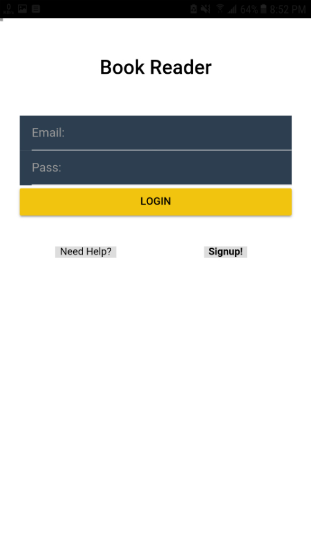
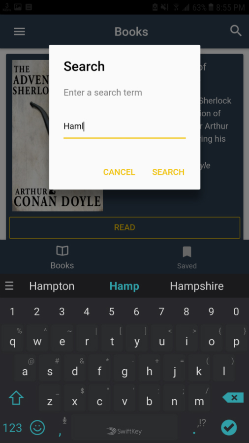

# Ionic 3 Book Reader App

[Book Reader App](./media/book-reader-flyer-complete-2.jpg)

The app Book Reader is ready for release. You just need to customize it for your needs, add your logos, edit package name and publish it. The app incorporates a beautiful design soothing to eyes of the reader.
You can browse list of available books, there authors, description and category, Read PDF books online, Save and download books that you like offline. It uses ionic-storage and Phone's disk for storing downloaded books. It uses internet connection to authenticate and to fetch list of books.

Following is the complete list of features availabe in the app:

* Login Form
* Sign Up Form
* View list of available Books
* Read Books Online
* Download and Save Books Offline
* Read Books Offline
* Delete (downloaded) Books from Phone Storage
* Search and Filter Books
* Tabs Design
* Side Menu Design (Navigation Drawer)
* Cool Yellow & Black Theme
* REST API Integration
* Retry on network failure (books page)
* Soothing Design
* About Page
* Help and Privacy Pages
* Ads Integration (standard ionic procedure)

## Why you should buy this App?
Authors' App
* If you are a Writer or Author. You can use this project to develop a Customized App for YOUR users, where they can discover and read all your books. It will also serve as a marketing platform and also as revenue source if you integrate ads.

Earn Revenue
* Users spend most time, other than social apps, in reading content. You can add you collection of books to this app. Integrate Ads and start earning revenue.

Your Digital Library
* Provide access to only students of your institue by using authentication and adding your Digital Books to your App.

## Can anyone Earn Revenue with this app?
Yes! even if you don't have copyrights on any books, you can find many books that are in public domain. Which means anyone can earn revenue on them. Like the books we've added in the code.

## Documentation
[Read the docs" src="./DOCS.md)

## Technologies
* Ionic 3
* Angular 5

## Supported Platforms 
* Android
* iOS
* Windows Phone

## Get the Code
[You can buy this on Codecanyon](https://codecanyon.net/user/rowburst)

## Screenshots

